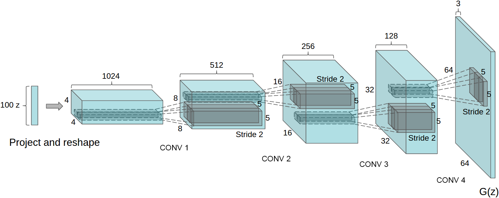

# Anime-Generator
This project is base on DCGAN, which is also called deep convolutional generative adversarial network
# DCGAN - Deep Convolutional Generative Adversarial Network
  In recnet years, there have been tremendous advancements in the field of machine learning. Lately a amount of research has been dedicated to the usage of generative models in the field of computer vision and iamge classification. The original model proposed by Goodfellow, which is composed of a adversarial nets and discriminative network. However, there are also existing some limitation of original GAN, such as it is unstable to train and resulting in generators that produce nonsensical output.
  
  DCGAN, which is also called deep convolutional generative adversarial networks having certain architectural constraints, is one of the successful network design for GAN. Compared with GAN, this model is more stable to train.
The following points are the core to the DCGAN which adopts some changes to CNN architectures.
- Replace any pooling layers with strided convolution (discriminator) and fractional-strided convolutions(generator), benifitting in learning spatial unsampling
- Remove fully connected hidden layers on top of convolutional features for deeper architectures.
- Use batch normalization which stabilizes learning in both the generator and the discriminator(except the generator output layer and the discriminator input layer)
- Use ReLU activation in generator for all layers except for the output, which uses Tanh function. The bounded activation allows the model to learn more quickly to saturate and cover the color space of the training distribution.

The following picture shows the structure of DCGAN generator used for LSUN scene modeling.

There some tuning tips quato from the paper
- minibatch size of 128
- The slope of the LeakyRuLU is 0.2
- Use Adam opyimizer to tune hyperparameters
- Learning rate is 0.0002

# The importance of DCGAN
Deep Convolutional Genetaive Adversarial Network is konwn to generate high quality images and the simplicity of its structure.With the problem that increasing the complexity of the generator does not necessarily improve the image quality, the DCGAN propose a way that generate image with higher quality in a stable way. 
In previous research, there  has been very limited published research in trying to understand and visualize what GANs learn, but this paper visualize the filters learnt by GANs and empirically show that specific filters have learned to draw specific objects.
- **Walking in the latent space** This shows signs of memorization and the way in which the space is hierarchically collapsed. The paper shows that walking in this latent space results in semantic changes to the image generations(window) showing the model has learned relevant representations

- **Visualizing the discriminator features** Although in an unsupervised way,DCGAN trained on a large image dataset can also learn a hierarchy of features
